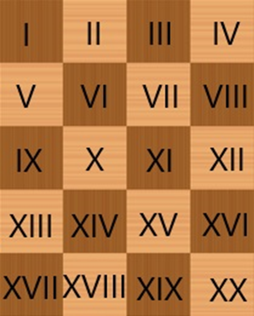

#3.-Introducción a la Inteligencia Artificial: Intro-spección

##Introducción 
El ajedrez es un antiguo juego de estrategia que ha cautivado la mente de jugadores de todo el mundo durante siglos. Se cree que el juego se originó en la India en el siglo VI, y desde entonces ha evolucionado y se ha extendido por diversas culturas y civilizaciones. A lo largo de la historia, el ajedrez ha sido más que un simple juego; ha sido un campo de batalla mental, una forma de arte y un medio para explorar la complejidad de la toma de decisiones estratégicas.
El juego se juega en un tablero cuadrado dividido en 64 casillas, alternando colores oscuros y claros. Cada jugador comienza con 16 piezas: un rey, una reina, dos torres, dos caballos, dos alfiles y ocho peones. El objetivo es someter al rey del oponente a un jaque mate, lo que significa que el rey está amenazado y no puede escapar de la amenaza.
El ajedrez es conocido por su profunda complejidad estratégica y táctica. Requiere habilidades cognitivas como la planificación a largo plazo, el pensamiento analítico, la memoria y la capacidad de evaluar posiciones de juego. Además, el ajedrez ha sido objeto de estudio en campos como la psicología, la inteligencia artificial y la filosofía debido a la riqueza de desafíos que presenta.
La introspección en el contexto de la inteligencia artificial se refiere a la capacidad de un sistema para examinar y comprender sus propios procesos internos, tomando conciencia de su propio estado y funcionamiento. Aunque la introspección en la IA no se equipara exactamente a la introspección humana, que implica una reflexión consciente y subjetiva, en la IA se refiere al análisis y comprensión de las decisiones y procesos internos de un sistema.
La introspección en la IA es un área de investigación importante, ya que busca mejorar la transparencia y la interpretabilidad de los modelos de inteligencia artificial. Los sistemas de IA modernos, especialmente los basados en aprendizaje profundo, a menudo son considerados como cajas negras debido a la complejidad de sus estructuras y algoritmos. La introspección busca abrir estas cajas negras, permitiendo a los desarrolladores y usuarios comprender mejor cómo y por qué un modelo de IA toma ciertas decisiones.
La introspección puede lograrse a través de diversas técnicas, como la visualización de capas internas de una red neuronal, el análisis de la importancia de las características en un modelo o la interpretación de las decisiones basadas en la entrada de datos. La introspección no solo mejora la confianza en los modelos de IA, sino que también puede ayudar a identificar sesgos y mejorar la ética en la implementación de sistemas de inteligencia artificial en aplicaciones del mundo real.
Problema
Coloca ocho alfiles (cuatro negros y cuatro blancos) en un tablero de ajedrez reducido, tal como se ve en la figura. El problema consiste en hacer que los alfiles negros intercambien sus posiciones con los blancos, ningún alfil debe atacar en ningún momento otro del color opuesto. Se deben alternar los movimientos, primero uno blanco, luego uno negro, luego uno blanco y así sucesivamente. ¿Cuál es el mínimo número de movimientos en que se puede conseguir?

##Solución 
Recapitulando lo comentado en la sección anterior, se nos requiere obtener un resultado satisfactorio al problema de poder intercambiar de posición todos los alfiles de color blanco con sus contrapartes negras. Para esto es fundamental el entender de antemano cual es el comportamiento de los alfiles con lo que respecta a su movimiento en un tablero, este mismo siendo un movimiento en diagonal indiferente de la dirección con respecto a un color en específico, es decir, si el alfil se encuentra inicialmente en una casilla blanca, solo se podrá mover en diagonal a otras casillas que compartan este mismo color.
Tomando en cuenta esto también es importante comprender las limitaciones de espacio que se presentan en el planteamiento del problema, las cuales se presentan en la forma de un tablero con dimensiones de 4 casillas de ancho por 5 casillas de alto. Tomando en cuenta que ambos grupos de alfiles estarán posicionados a los respectivos extremos, nos deja un área de movimientos disponibles al centro del tablero de 4 casillas de ancho por 3 de alto. A continuación, se presenta una representación de grafica del tablero el cual cuenta con una identificación única para cada una de sus casillas para que sea más sencillo poder visualizar el recorrido de cada una de las piezas y corroborar que se obtiene un resultado satisfactorio,

